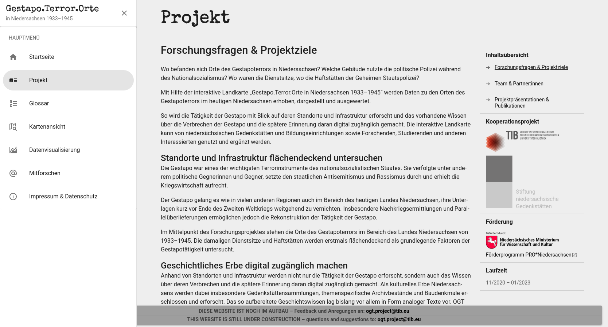
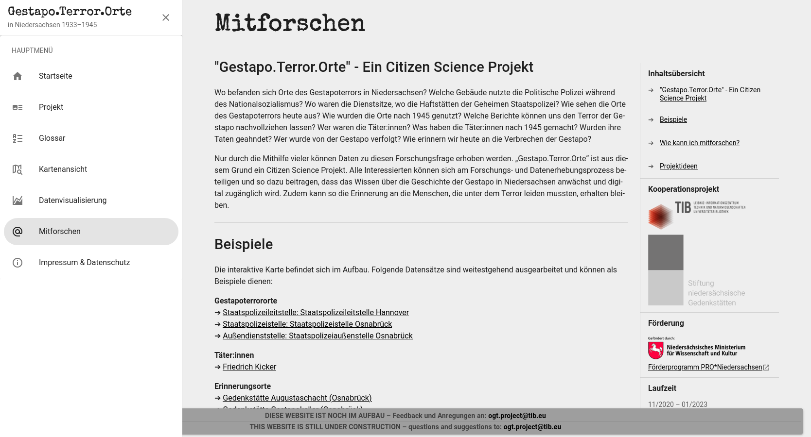

[](http://tib.eu/gestapo-terror-orte)

# Table of contents
- [OGT web app](#ogt-web-map)
  - [About OGT project](#about-ogt-project)
  - [Published contributions](#published-contributions)
- [Preview](#preview)
- [Built with](#built-with)
- [Getting Started](#getting-started)
  - [Install requirements](#install-requirements) 
  - [Setup on local system](#setup-on-local-system)
  - [Config app env](#config-app-env)
- [Contributing and contact](#contributing-and-contact)
- [License](#license)

# OGT web map
This is the repository of the OGT project's web map.
The web map, based on OpenStreetMap and Leaflet, shows places of Gestapo terror and places of remembrance. 
Additional information can be displayed for each place and the places are linked to each other and to perpetrators and victims.
Further information can be found in a glossary and visualizations of the data from Wikidata can be embedded.

The data is retrieved from Wikidata via Laravel with SPARQL.
Laravel serves as a full-stack framework.
The frontend was developed with Vue.js and Vuetify.

* **[OGT website](http://tib.eu/gestapo-terror-orte)**

## About OGT project
> The project aims both to research the activities of the Gestapo with regard to its locations and infrastructure and to 
make available digitally the existing knowledge about the crimes of the Gestapo and the later memory of them. 
A four-dimensional map, in conjunction with a Wikidata, serves to record archive, literature and other source 
material, evaluate it for research purposes and publish it as an interactive internet presence. 
The project further develops the open source prototype of the research database into a public resource that can be used 
and supplemented by memorials and educational institutions in Lower Saxony as well as by researchers, students and other 
interested parties.

* [OGT @ TIB projects](https://projects.tib.eu/ogt-orte-des-gestapoterrors/en/project/)
* [OGT @ TIB project overview](https://www.tib.eu/en/research-development/project-overview/project-summary/ogt-orte-des-gestapoterrors)
* [OGT @ Wikidata:WikiProjects](https://www.wikidata.org/wiki/Wikidata:WikiProject_NS_Perpetrator_Research)

## Published contributions
* Zenodo – [Surveillance and Terror - the Gestapo as an Instrument of the Nazi Regime](https://zenodo.org/record/6817273) (only DE)
* Zenodo – [project presentation](https://zenodo.org/record/5589811) for conference "Digital Memory - Digital History - Digital Mapping. Transformations of Memory Cultures and Holocaust Education" (only DE) 
* Zenodo – Excerpt from the [project application](https://zenodo.org/record/4313236) (only DE)
* BuB – Library and Information Forum – [Making Gestapo crimes digitally visible](https://b-u-b.de/detail/verbrechen-der-gestapo-digital-sichtbar-machen) (only DE)
* TIB press release [Traces of the past: making Gestapo crimes digitally visible](https://www.tib.eu/en/die-tib/neuigkeiten-und-termine/aktuelles/detail/spuren-der-vergangenheit-verbrechen-der-gestapo-digital-sichtbar-machen)

# Preview
**Go directly to the [OGT website](http://tib.eu/gestapo-terror-orte) and try it out!**

<p align="middle">
  
   
</p>
<p align="middle">
  
   
</p>
<p align="middle">
  
   
</p>

# Built with
* [Laravel](https://laravel.com/), a free and open-source PHP web framework ([repository](https://github.com/laravel/laravel)).
* [PHPUnit](https://phpunit.de/), a unit testing framework for PHP ([repository](https://github.com/sebastianbergmann/phpunit/)).
* [Laravel Envoy](https://laravel.com/docs/envoy), a tool for executing common tasks to run on remote servers ([repository](https://github.com/laravel/envoy)).
* [Composer](https://getcomposer.org/), an application-level dependency manager for PHP ([repository](https://github.com/composer/composer)).
  * See [`composer.json`](composer.json) for more information. 


* [Vue.js](https://vuejs.org/), an open-source model–view–viewmodel front end JavaScript framework ([repository](https://github.com/vuejs/core)).
* [Vuetify](https://vuetifyjs.com/en/), a Vue UI Library ([repository](https://github.com/vuetifyjs/vuetify)). 
* [Leaflet](https://leafletjs.com/), a JavaScript library for mobile-friendly interactive maps ([repository](https://github.com/Leaflet/Leaflet)).
* [OpenStreetMap](https://www.openstreetmap.org), a free, open geographic database.
* [npm](https://www.npmjs.com/), a package manager for JavaScript ([repository](https://github.com/npm/cli)).
  * See [`package.json`](package.json) for more information.


* [Wikidata](https://www.wikidata.org), a collaboratively edited multilingual knowledge graph.
* [SPARQL](https://www.w3.org/TR/sparql11-query/), a RDF query language.

# Getting Started
Instructions for setting up project website on local system.
To get a local copy up and running follow these steps.

## Install requirements
Software you need to run the OGT website and how to install them for **Ubuntu**.
  ```sh 
  sudo apt update && sudo apt upgrade
  ```

* Git (not required, if you download project zip package)
  ```sh 
  sudo apt install git
  ```

* PHP and required [PHP packages for Laravel](https://laravel.com/docs/8.x/deployment#server-requirements) and  for NGINX
    ```sh
    sudo apt install php7.4-fpm
    sudo apt install php7.4-bcmath php7.4-mbstring php7.4-xml
    ```

* Composer
    ```sh
    sudo apt-get install composer
    ``` 

* npm
  ```sh
  sudo apt-get install npm
  ```


## Setup on local system
1. Clone the repository
   ```sh 
   git clone https://github.com/TIBHannover/ogt-web-map.git 
   ```
   or download zip package from [GitHub](https://github.com/TIBHannover/ogt-web-map/archive/refs/heads/master.zip) and unzip into a directory.


2. Create env, generate key, install libs, compile files and start Laravel development server.  
   ```sh
   cd ogt-api/
   cp .env.example .env
   php artisan key:generate
   composer install
   npm install
   npm run dev
   php artisan serve
   ```
   Open OGT-website in browser, default: http://127.0.0.1:8000

## Config app env
See [`.env`](.env) for more variables.

| variable | value      | description                                                                                |
|----------|------------|--------------------------------------------------------------------------------------------|
| APP_ENV  | local      | App configured for local. Features that are for testing or still in planning are disabled. |
| APP_ENV  | testing    | Features that are for testing or still in planning are enabled.                            |
| APP_ENV  | production | Features that are for testing or still in planning are disabled.                           |

# Contributing and contact
Thank you for considering contributing to the OGT project. 
If you have any questions or suggestions, or if you discover a security vulnerability, please send an e-mail to:
[:mailbox_with_mail:](mailto:ogt.project@tib.eu) <ogt.project@tib.eu>

All security vulnerabilities will be promptly addressed.

# Partners
[](https://www.tib.eu/en/)

[](https://www.stiftung-ng.de/en/)

[](https://www.mwk.niedersachsen.de/startseite/)

# License
The OGT project is open-sourced software distributed under the GNU GPLv3 License.
See [`LICENSE`](LICENSE) for more information.